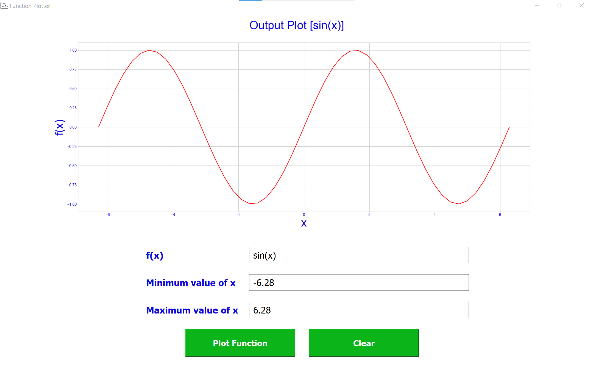

# Function-Plotter

## Brief:

A‌ ‌Python‌ ‌GUI‌ ‌program‌ ‌that‌ ‌plots‌ ‌arbitrary‌ user-entered‌ ‌function.‌ Taking ‌min‌ ‌and‌ ‌max‌ ‌values‌ ‌of‌ ‌x‌ ‌from‌ ‌the‌ ‌user.‌ ‌e.g.,‌ ‌5*x^3‌ ‌+‌ ‌2*x.‌ ‌
The‌ ‌following‌ ‌operators‌ ‌are‌ ‌supported:‌ (‌+‌ ‌-‌ ‌/‌ ‌*‌ ‌^), 
logarithmic and trigonometric function are also supported by installing numpy.


## Requirements installation:

```
pip install -r requirements.txt
```

## Running the program:

```
python main.py
```


## Screenshots:

<div>
  <p align="center">
    
    
    
    
    
    
    
    
    
    
  </p>
  </div>
